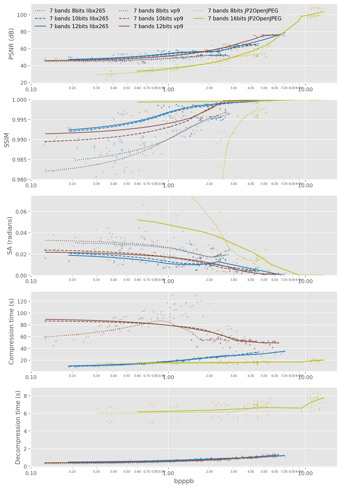
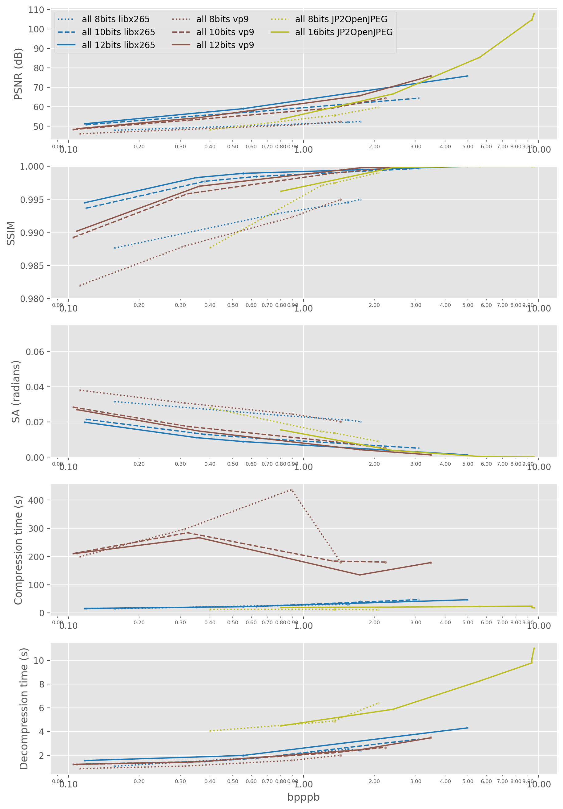
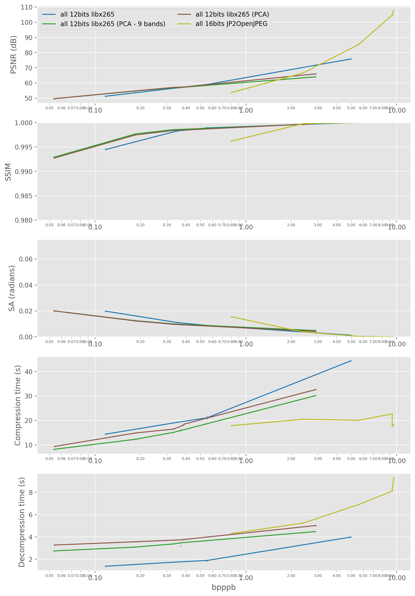
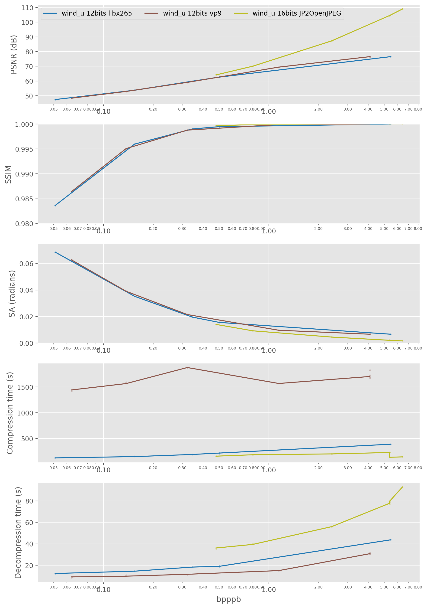
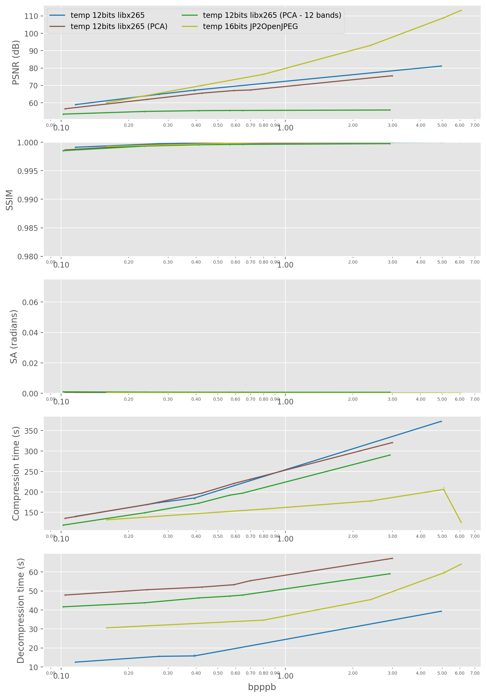

# xarrayvideo

Save multichannel data from xarray datasets as videos to save up massive amounts of space (e.g. 20-50x compression) with minimal quality loss.

This library provides two functions: `xarray2video` to encode some `xarray` variables into videos, and `video2xarray` to rebuild the xarray from the videos. It can encode lossily or losslessly, supporting all video formats supported by ffmpeg (e.g., x265, vp9) at different bit depths (e.g., 8,10,12,16) as well as all GDAL's supported image formats (e.g. JPEG2000) for frame-by-frame encoding (provided mostly as a comparison baseline).

## Features

- Support for all ffmpeg-supported video codecs (mutichannel images are stored in sets of 3 channels)
- Support for all GDAL-supported image codecs (every timestep is stored in a different image file, but all channels are stored together if using e.g. JPEG2000).
- Support for many pixel formats, depending on the codec: 8 / 10 / 12 / 16 bits, planar / non-planar, etc.
- Lossy & lossless encoding are both supported: `libx265` is recommended for lossy, and `ffv1` for lossless
- KLT / PCA transform: You can specify a number of principal components (ideally a multiple of 3), and PCA is applied over the channel dimension. You can choose how many principal components (PCs) to keep, and even particular quality options for different PCs. Videos are encoded then in sets of 3 channels.

LIMITATIONS: As of now, everything is loaded in memory, which will be a problem for larger datasets. Future versions of this library will allow for indexing of frame ranges within the video file, as well as lazy loading.

## Paper

If you find this library useful, please consider citing the accompanying paper:

```
Paper on progress
```

## Results

### DeepExtremeCubes

An example `xarray` from the DeepExtremeCubes database is provided as an example. It consists of 495 timesteps of 128x128 Sentinel2 data sampled every 5 days, along with other segmentation maps:

- For the Sentinel2 data, the library automatically compresses lossily all 7 bands `'B04','B03','B02','B8A','B05','B06','B07'` into 3 videos (as each video can only encode up to 3 bands at a time). See Figure below for compression results.
- The cloud mask with 5 classes is compressed losslessly to 0.3403 bpppb (23.5x compression).
- Sentinel's Scene Classification Layer (SCL) is compressed losslessly to 0.1001 bpppb (79.9x compression).

Here is a plot with some results of different compression approaches for the multiespectral Sentinel 2 data (7 bands). Note that we also use JPEG2000 as a comparison, encoding every timestep at a time (but all bands 7 in a single image, instead of relying on sets of 3 bands as for video compression):



For this data, some conclusions can be reached. In summary: `x265 > vp9 >> JPEG2000` and `16 > 12 > 10 >> 8` bits.

- 8bits is always inferior to 10-16bits, and 12 bits is slightly better than 10 bits.
- Video compression (either x265 or vp9) is always better than JPEG2000 compression of each timestep separately
- x265 is slightly better and much quicker than vp9 in compression, so it is preferred
- JPEG2000 is the slowest for decompression
- **Overall, very high reconstruction quality (PSNR > 50dB) can be achieved at very high compression rates (bpppb < 1, i.e., for 32bit floats this is a compression factor of >32x)**

Example of compression (1.47% of original size). The quality loss is visually imperceptible.

Original (download for full size):


Compressed (download for full size):


These visualizations were generated using [txyvis](https://github.com/OscarPellicer/txyvis)

### Cesar's cube

This test dataset consists of a single cube of 512x512 Sentinel 2 images of 102 timesteps, where every timestep corresponds to a month of observations, that was processed to exclude clouds. It contains 10 bands: `'B2', 'B3', 'B4', 'B5', 'B6', 'B7', 'B8', 'B8A', 'B11', 'B12'`.



The conclusions are similar to the previous datacube:

- This data is easier to compress (probably due to the absence of clouds) achieving overall higher PSNRs than for the previous data
- x265 is overall better than JPEG2000, winning in ~10db PSNR at 1bpppb
- x265 much quicker and slightly better than vp9, so it is preferred
- **Overall, excellent reconstruction quality (PSNR > 65dB) can be achieved at very high compression rates (bpppb < 1, i.e., for 32bit floats this is a compression factor of >32x)**

#### About using PCA

For this data, we additionally compare the base approach of encoding all 11 channels in sets of 3 videos, with two other approaches: 

- Apply PCA, and then encode with a quality that decreases for less important PCs
- Apply PCA, and then encode all channels with the same quality, but drop the last 2 channels, so all bands fit in just 3 videos of 3 channels each.

The results for this tests are the following:



As can be seen, the base approach of encoding without PCA seems to peform best. This is likely due to PCA shifting the distribution of the data so that standard video codecs, not designed for this data, do not work opimally.

### ERA5

We will 284 timesteps (period of 6h) of ERA5's `wind_u` variable at its native resolution (1440x721x13), hence this being 13-channel dataset. For this test, we don't include 8 or 10 bits results for faster results, since we saw that hihger bits are generally better.



In this case, the conclusions are different from the satellite data. Overall, JPEG200 seems to do better for all metrics considered, except for decoding time (which could be improved with parallel reading). It might be the case that video codecs fail to efficiently encode ERA5 data, which deviates significantly from the natural images that they were designed to encode.

#### About using PCA

Similarly, we additionally compare the base approach of encoding all 13 height levels in sets of 3 videos, with the two other PCA-based approaches. We also encode the `temperature` variable this time.



Once again, JPEG2000 is superior to all the video encoding methods, and PCA is inferior to direct encoding.

## Installation

Before installing, GDAL is an optional dependency but is required for some functionality. Installation methods vary by operating system:

Linux and macOS:

```bash
pip install xarrayvideo[gdal]
```

Windows:

```bash
mamba install -c conda-forge gdal
# or
conda install -c conda-forge gdal
```

Test installation:

```bash
git clone https://github.com/OscarPellicer/xarrayvideo.git
cd xarrayvideo
pip install -e .[all] #--no-deps
```

Standard installation (WIP):

```bash
# To install with all dependencies except gdal (very recommended)
pip install xarrayvideo[all] 

# To install with only the base dependencies
pip install xarrayvideo

# Also possible
pip install xarrayvideo[satalign] # For temporal alignment of video slices
pip install xarrayvideo[plotting] # For plotting functionality
pip install xarrayvideo[metrics] # For quicker metrics calculation
```

Step-by-step manual installation:

```bash
# Install base requirements
pip install xarray numpy ffmpeg scikit-image scikit-learn pyyaml zarr netcdf4 ffmpeg-python gdal gcsfs openjpeg tqdm seaborn
# mamba install xarray numpy ffmpeg scikit-image scikit-learn pyyaml zarr netcdf4 ffmpeg-python gcsfs tqdm seaborn
# mamba install -c gdal-master gdal openjpeg

# [Optional] Requirements for temporal alignment of video slices
pip install satalign

# [Optional] Requirements for plotting (optional, but `plot_image` calls will fail)
pip install ipython opencv-python
pip install git+https://github.com/OscarPellicer/txyvis.git

# [Optional] Requirements for much quicker metrics
pip install torchmetrics
# mamba install torchmetrics

# Download repo and install it with not dependencies
cd ~
git clone https://github.com/OscarPellicer/xarrayvideo.git
cd xarrayvideo
pip install -e . --no-deps

# Unzip the example xarray
unzip cube.zip
```

## Usage

To see some examples run `jupyter lab` or VSCode to open `example.ipynb`

The basic syntax (for the DeepExtremesCubes database) is the following:

```python
# Load libraries
import xarray as xr
import numpy as np
from xarrayvideo import xarray2video, video2xarray, plot_image

# Define paths
array_id= '-111.49_38.60'
input_path= '../mc_-111.49_38.60_1.2.2_20230702_0.zarr'
output_path= './out'

# Load cube
minicube= xr.open_dataset(input_path, engine='zarr')
minicube['SCL']= minicube['SCL'].astype(np.uint8) #Fixes problem with the dataset
minicube['cloudmask_en']= minicube['cloudmask_en'].astype(np.uint8)

# Set up the compression params
lossless_params= { 'c:v':'ffv1' }
lossy_params= { 'c:v': 'libx265', 'preset': 'medium', 'crf': 1, 
                'x265-params': 'qpmin=0:qpmax=0.1:psy-rd=0:psy-rdoq=0'  }
conversion_rules= {
    's2': ( ('B07','B06','B05','B04','B03','B02','B8A'), 
                ('time','x','y'), 0, lossy_params, 12),
    'scl': ( 'SCL', ('time','x','y'), 0, lossless_params, 8),
    'cm': ( 'cloudmask_en', ('time','x','y'), 0, lossless_params, 8),
    }
    
# Compress, with compute_stats it takes a bit longer, but shows compression info
arr_dict= xarray2video(minicube, array_id, conversion_rules,
                       output_path=output_path, compute_stats=True,
                       loglevel='verbose', save_dataset= True
                       )  
    
# Decompress
minicube_new= video2xarray(output_path, array_id)

# Plot RGB bands
plot_image(minicube, ['B04','B03','B02'], save_name='./out/RGB original.jpg')
plot_image(minicube_new, ['B04','B03','B02'], save_name='./out/RGB compressed.jpg')
```

## Contact

Contact me: `oscar.pellicer [at] uv.es` or open an Issue.
