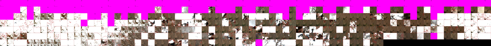

# xarrayvideo
Save multichannel data from xarray datasets as videos to save up massive amounts of space (e.g. 20x compression).

Basically, this library provides two functions: `xarray2video` to encode some `xarray` variables into videos, and `video2xarray` to rebuild the xarray from the videos. As of now, everything is loaded in memory, and lossy compression only accepts videos with 3 chanels (WIP for 1 and 4 channels).

In development

## Installation 

```
cd ~
git clone https://github.com/OscarPellicer/xarrayvideo.git
cd xarrayvideo
```

Then run `jupyter lab` or VSCode to open example.ipynb

## Examples

Example of conversion 23.20Mb -> 0.75Mb (3.22% of original size).

Original (download for full size):


Compressed (download for full size):


These visualizations were generated using [txyvis](https://github.com/OscarPellicer/txyvis)