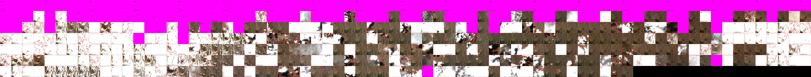
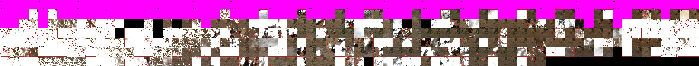

# xarrayvideo
Save multichannel data from xarray datasets as videos to save up massive amounts of space (e.g. 20-50x compression).

Basically, this library provides two functions: `xarray2video` to encode some `xarray` variables into videos, and `video2xarray` to rebuild the xarray from the videos. As of now, everything is loaded in memory, and lossy compression only accepts videos with 3 chanels (WIP for 1 and 4 channels).

For the provided example `xarray`, we compress bands `'B04','B03','B02'` into video `rgb` (lossy), bands `'B8A','B06','B05'` (lossy) into video ir3, a cloud mask with 5 classes into video `cm` (lossless) and Sentinel's Scene Classification Layer (SCL) into video `scl` (lossless).

```
rgb: 23.20Mb -> 0.95Mb (4.11% of original size) in 1.10s
 - params={'c:v': 'libx264', 'preset': 'slow', 'crf': 11, 'pix_fmt': 'rgb24', 'r': 30}
 - SSIM_sat 0.998597 (input saturated to [(0.0, 1.0)])
 - MSE_sat 0.000055 (input saturated to [(0.0, 1.0)])
ir3: 23.20Mb -> 0.93Mb (4.01% of original size) in 1.17s
 - params={'c:v': 'libx264', 'preset': 'slow', 'crf': 11, 'pix_fmt': 'rgb24', 'r': 30}
 - SSIM_sat 0.998346 (input saturated to [(0.0, 1.0)])
 - MSE_sat 0.000064 (input saturated to [(0.0, 1.0)])
cm: 7.73Mb -> 0.08Mb (0.98% of original size) in 0.10s
 - params={'vcodec': 'ffv1', 'pix_fmt': 'gray', 'r': 30}
 - acc 1.00
scl: 7.73Mb -> 0.29Mb (3.70% of original size) in 0.20s
 - params={'vcodec': 'ffv1', 'pix_fmt': 'gray', 'r': 30}
 - acc 1.00
```

## Installation 

```
#Install base requirements
pip install xarray numpy ffmpeg scikit-image

#Requiremetns for temporal alignment
pip install satalign

#Insall requierements for plotting (optional, but `plot_image` calls will fail)
pip install ipython cv2
pip install git+https://github.com/OscarPellicer/txyvis.git

#Install repo
cd ~
git clone https://github.com/OscarPellicer/xarrayvideo.git
cd xarrayvideo

#Unzip the example xarray
!unzip cube.zip
```

Then run `jupyter lab` or VSCode to open example.ipynb

## Examples

Example of compression 23.20Mb -> 0.95Mb (4.11% of original size). The quality loss is visually imperceptible.

Original (download for full size):


Compressed (download for full size):


These visualizations were generated using [txyvis](https://github.com/OscarPellicer/txyvis)