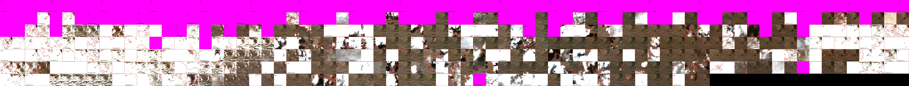

# xarrayvideo

Save multichannel data from xarray datasets as videos to save up massive amounts of space (e.g. 20-50x compression).

Basically, this library provides two functions: `xarray2video` to encode some `xarray` variables into videos, and `video2xarray` to rebuild the xarray from the videos. As of now, everything is loaded in memory, and lossy compression only accepts videos with 3 chanels.

For the provided example `xarray`, we compress bands `'B04','B03','B02'` into video `rgb` (lossy), bands `'B8A','B06','B05'` (lossy) into video ir3, a cloud mask with 5 classes into video `cm` (lossless) and Sentinel's Scene Classification Layer (SCL) into video `scl` (lossless).

```{}
rgb: 92.81Mb -> 1.37Mb (1.47% of original size) in 11.32s
 - params={'c:v': 'libx265', 'preset': 'slow', 'crf': 6, 'pix_fmt': 'yuv444p10le', 'r': 30}
 - Decompression time 0.18s
 - MSE_sat 0.000020 (input saturated to [(0.0, 1.0)])
 - SNR_sat 39.4120 (input saturated to [(0.0, 1.0)])
 - PSNR_sat 47.0182 (input saturated to [(0.0, 1.0)])
 - Exp. SA 0.0167 (input saturated to [(0.0, 1.0)])
 - Err. SA 0.0001 (input saturated to [(0.0, 1.0)])
 
ir3: 92.81Mb -> 1.37Mb (1.47% of original size) in 12.01s
 - params={'c:v': 'libx265', 'preset': 'slow', 'crf': 6, 'pix_fmt': 'yuv444p10le', 'r': 30}
 - Decompression time 0.20s
 - MSE_sat 0.000027 (input saturated to [(0.0, 1.0)])
 - SNR_sat 38.3215 (input saturated to [(0.0, 1.0)])
 - PSNR_sat 45.7592 (input saturated to [(0.0, 1.0)])
 - Exp. SA 0.0129 (input saturated to [(0.0, 1.0)])
 - Err. SA 0.0000 (input saturated to [(0.0, 1.0)])
 
cm: 7.73Mb -> 0.08Mb (0.98% of original size) in 0.10s
 - params={'vcodec': 'ffv1', 'pix_fmt': 'gray', 'r': 30}
 - acc 1.00
 
scl: 7.73Mb -> 0.29Mb (3.70% of original size) in 0.20s
 - params={'vcodec': 'ffv1', 'pix_fmt': 'gray', 'r': 30}
 - acc 1.00
```

Here is a plot with some results of different compression approaches for this data:


## Features

- Support for all ffmpeg-supported video codecs (mutichannel images are stored in sets of 3 channels)
- Support for all GDAL-supported image codecs (channels are stored in single image if using e.g. JPEG2000, but every timestep is stored in a different file)
- Planar / non-planar input formats (depends on video codec)
- 8 / 10 / 12 / 16 bits (depends on video codec)
- Lossy & lossless encoding
- Numbers of channels
  - 1 channel: great lossless compression with `ffv1` (8,10,12,16 bits), lossy compression supported with channel duplication (see N channels)
  - 3 channels: great lossless compression with `vp9, lossless 1` (8,10,12 bits), great lossy comporession with `x264` (8,10 bits, slightly quicker compression times) or `x265` (8,10,12 bits, better compression, more options) 
  - N channels: channels are split into N//3 videos automatically, with the last video containing the last channel repeated 1/2 times if N is not a multiple of 3
- KLT / PCA transform: You can specify a number of principal components (ideally a multiple of 3), and PCA is applied over the channel dimension. Videos are encoded in sets of 3 channels

## Datasets used for testing (WIP):
 - DeepExtremesCubes
 - ERA5
 - Cesar's cube

## Installation

```{bash}
#Install base requirements
pip install xarray numpy ffmpeg scikit-image scikit-learn pyyaml zarr netcdf4 ffmpeg-python gdal gcsfs openjpeg tqdm seaborn
#mamba install xarray numpy ffmpeg scikit-image scikit-learn pyyaml zarr netcdf4 ffmpeg-python gcsfs tqdm seaborn
#mamba install -c gdal-master gdal openjpeg

#[Optional] Requiremetns for temporal alignment of video slices
pip install satalign

#[Optional] Requierements for plotting (optional, but `plot_image` calls will fail)
pip install ipython opencv-python
pip install git+https://github.com/OscarPellicer/txyvis.git

#[Optional] Requierements for much quicker metrics
pip install torchmetrics
#mamba install torchmetrics

#Download repo
cd ~
git clone https://github.com/OscarPellicer/xarrayvideo.git
cd xarrayvideo

#Unzip the example xarray
!unzip cube.zip
```

Then run `jupyter lab` or VSCode to open example.ipynb

## Examples

Example of compression 92.81Mb -> 1.37Mb (1.47% of original size). The quality loss is visually imperceptible.

Original (download for full size):


Compressed (download for full size):


These visualizations were generated using [txyvis](https://github.com/OscarPellicer/txyvis)